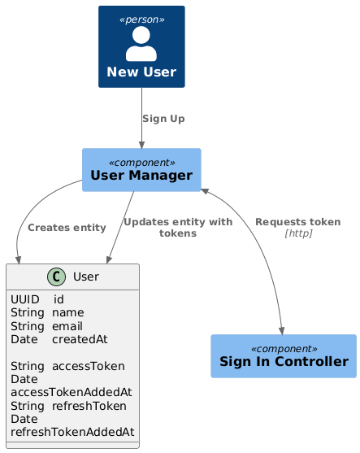
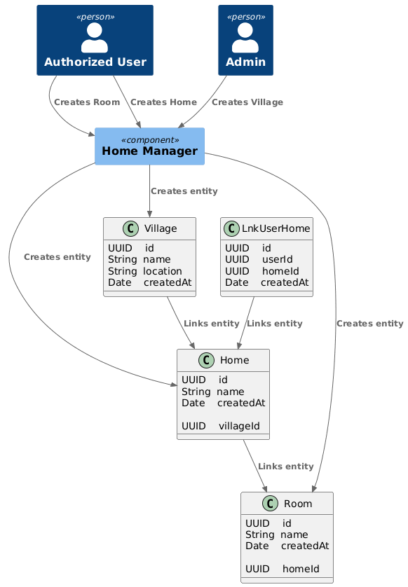
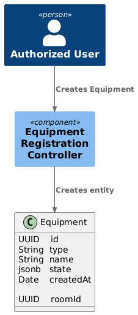

# Code Diagram

## Регистрация нового пользователя

### Description

- Сервис управления пользователями создает запись в БД
- Сервис управления пользователями запрашивает токены аутентификации в сервисе аутентификации
- Сервис управления пользователями обновляет запись в БД

### Image

## Создание умного дома авторизованным пользователем

### Description

- Администратор системы создает "поселок"
- Авторизованный пользователь создает свой "умный дом"
- Авторизованный пользователь создает комнаты в своем доме

### Image

## Регистрация нового устройства авторизованным пользователем

### Description

- Авторизованный пользователь создает новое устройство в комнату в своем доме
- Поле "type" - тип оборудования, например, датчик или лампочка
- Поле "state" предназначено для хранения информации о состоянии устройства в виде объекта ключ-значение. Например, для датчика температуры, ключ - "температура", значение - "24". Для умного выключателя, ключ - "питание", значение - "выключено".

### Image

