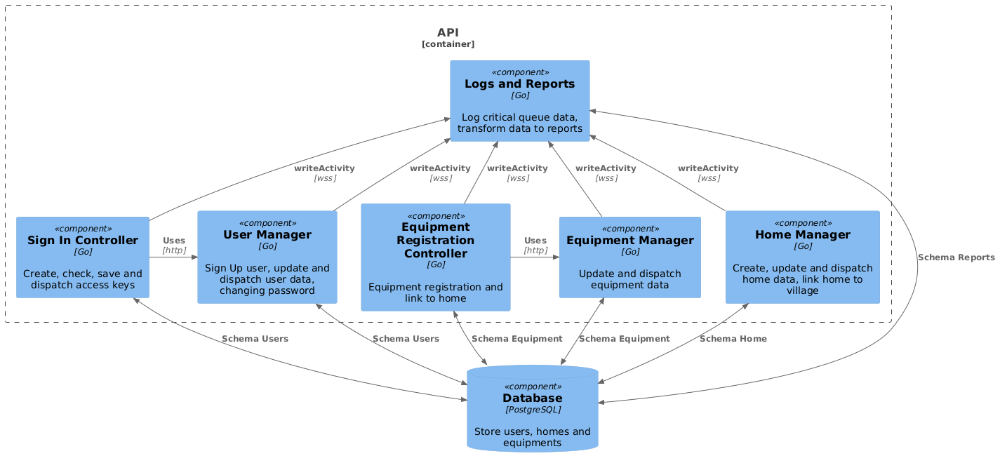

# Component Diagram

## Description

Пользователи:
- Сервис аутентификации пользователей
- Сервис управления пользователями
- Сервис аутентификации пользователей использует сервис управления пользователями

Оборудование:
- Сервис регистрации устройств
- Сервис управления устройствами
- Сервис регистрации устройств использует сервис управления устройствами

Дома:
- Сервис управления домами (Состав дома по комнатам, привзяка к поселкам и регионам)

Отчеты:
- Сервис логирования и отчетов (записывает данные и трансформирует в форму для аналитики)

## Image

