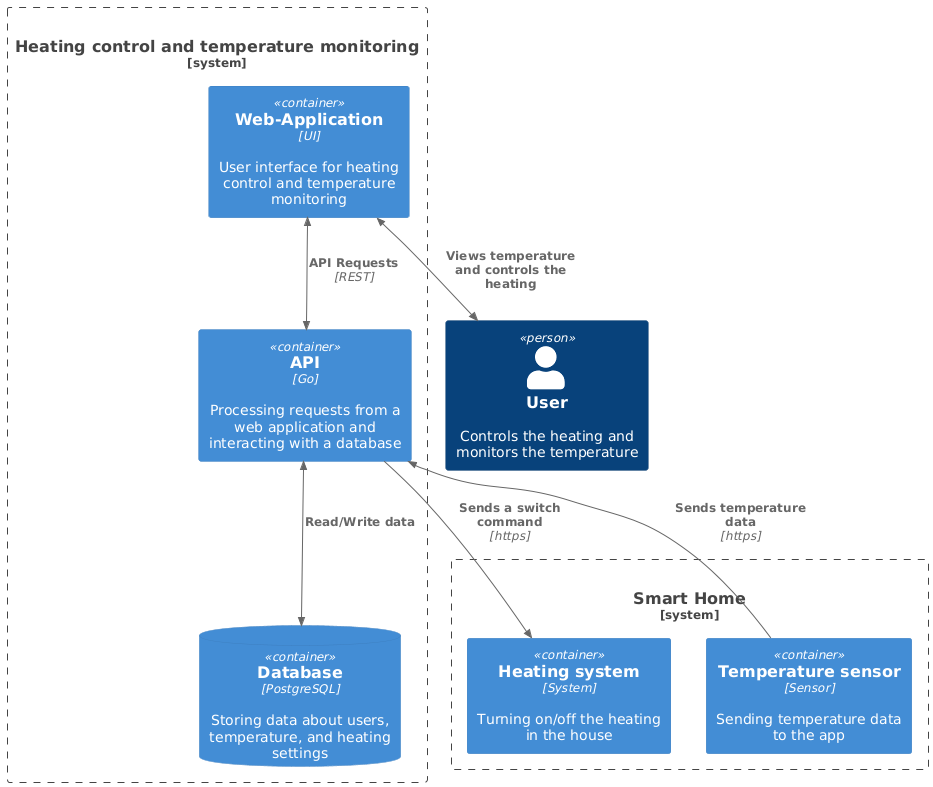

# Container Diagram

## Description

- Пользователь взаимодействует с приложением через web интерфейс, чтобы управлять отоплением и просматривать текущую температуру
- Web интерфейс взаимодействует с API с помощью HTTPS запросов
- Приложение запрашивает данные о температуре с датчиков с помощью HTTPS запросов
- Приложение отправляет команды по управлению отоплением с помощью HTTPS запросов
- Приложение записывает данный в базу данных

## Image

