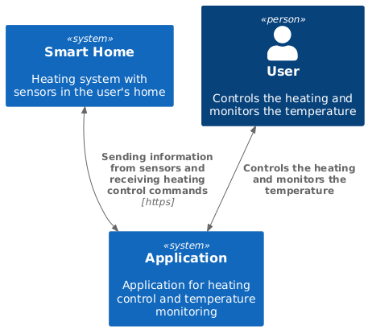

# Context Diagram

## Description

- Пользователь взаимодействует с приложением, чтобы управлять отоплением и просматривать текущую температуру
- Приложение запрашивает данные о температуре с датчиков
- Приложение отправляет команды по управлению отоплением

## Image

